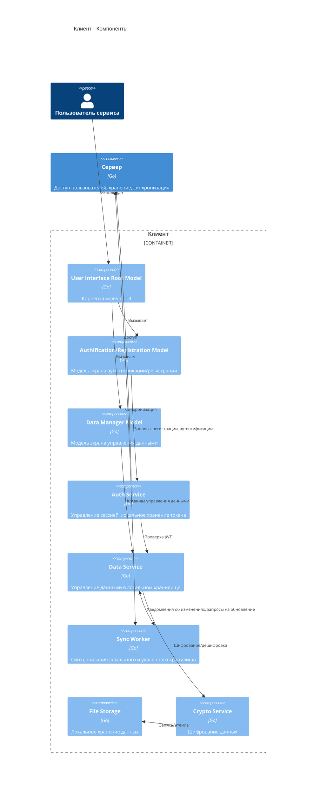

```mermaid
    C4Component
        title Клиент - Компоненты

        Person(Пользователь, "Пользователь сервиса")
        Container_Boundary(client, "Клиент") {
            Component(TUIRoot, "User Interface Root Model", "Go", "Корневая модель TUI")
            Component(AuthModel, "Authification/Registration Model", "Go", "Модель экрана аутентификации/регистрации")
            Component(DataModel, "Data Manager Model", "Go", "Модель экрана управления данными")
            Component(AuthService, "Auth Service", "Go", "Управление сессией, локальное хранение токена")
            Component(DataService, "Data Service", "Go", "Управление данными в локальном хранилище")
            Component(SyncWorker, "Sync Worker", "Go", "Синхронизация локального и удаленного хранилища")
            Component(FileStorage, "File Storage", "Go", "Локальное хранение данных")
            Component(Crypto, "Crypto Service", "Go", "Шифрование данных")
        }
        Container(Server, "Сервер", "Go","Доступ пользователей, хранение, синхронизация")

        Rel(Пользователь, TUIRoot, "Использует")
        Rel(TUIRoot, AuthModel, "Вызывает")
        Rel(TUIRoot, DataModel, "Вызывает")
        Rel(AuthModel, AuthService, "Запросы регистрации, аутентификации")
        Rel(DataModel, DataService, "Команды управления данными")
        Rel(AuthService, DataService, "Проверка JWT")
        Rel(DataService, Crypto, "Шифрование/дешифровка")
        Rel(Crypto, FileStorage, "Запись/чтение")
        BiRel(DataService, SyncWorker, "Уведомления об изменениях, запросы на обновление")
        Rel(AuthService, Server, "Доступ")
        BiRel(SyncWorker, Server, "Синхронизация")
```