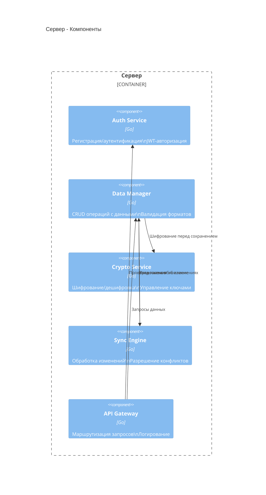

```mermaid
    C4Component
        title Сервер - Компоненты

        Container_Boundary(server, "Сервер") {
            Component(Auth, "Auth Service", "Go", "Регистрация/аутентификация\nJWT-авторизация")
            Component(DataManager, "Data Manager", "Go", "CRUD операций с данными\nВалидация форматов")
            Component(Crypto, "Crypto Service", "Go", "Шифрование/дешифровка\nУправление ключами")
            Component(SyncEngine, "Sync Engine", "Go", "Обработка изменений\nРазрешение конфликтов")
            Component(API_Gateway, "API Gateway", "Go", "Маршрутизация запросов\nЛогирование")
        }

        Rel(API_Gateway, Auth, "Проверка токенов")
        Rel(API_Gateway, DataManager, "Запросы данных")
        Rel(DataManager, Crypto, "Шифрование перед сохранением")
        Rel(DataManager, SyncEngine, "Уведомления об изменениях")
        Rel(SyncEngine, DataManager, "Запросы на обновление")
```