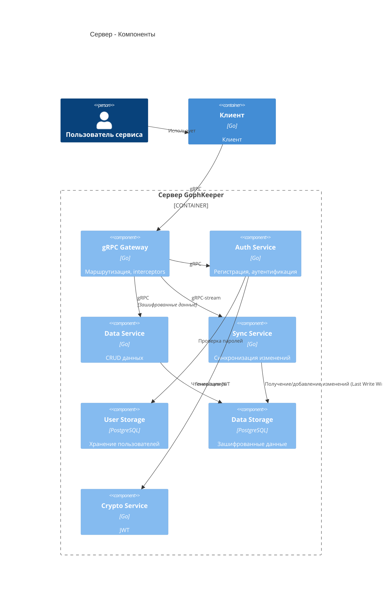

```mermaid
    C4Component
        title Сервер - Компоненты

        Person(Пользователь, "Пользователь сервиса")
        Container_Boundary(server, "Сервер GophKeeper") {
            Component(GrpcGateway, "gRPC Gateway", "Go", "Маршрутизация, interceptors")
            Component(AuthService, "Auth Service", "Go", "Регистрация, аутентификация")
            Component(DataService, "Data Service", "Go", "CRUD данных")
            Component(SyncService, "Sync Service", "Go", "Синхронизация изменений")
            Component(UserStorage, "User Storage", "PostgreSQL", "Хранение пользователей")
            Component(DataStorage, "Data Storage", "PostgreSQL", "Зашифрованные данные")
            Component(Crypto, "Crypto Service", "Go", "JWT")
        }

        Container(client, "Клиент", "Go", "Клиент")

        Rel(Пользователь, client, "Использует")
        Rel(client, GrpcGateway, "gRPC")
        Rel(GrpcGateway, AuthService, "gRPC")
        Rel(GrpcGateway, DataService, "gRPC", "Зашифрованные данные")
        Rel(GrpcGateway, SyncService, "gRPC-stream")
        Rel(AuthService, UserStorage, "Проверка паролей")
        Rel(DataService, DataStorage, "Чтение/запись")
        Rel(SyncService, DataStorage, "Получение/добавление изменений (Last Write Wins)")
        Rel(AuthService, Crypto, "Генерация JWT")
```