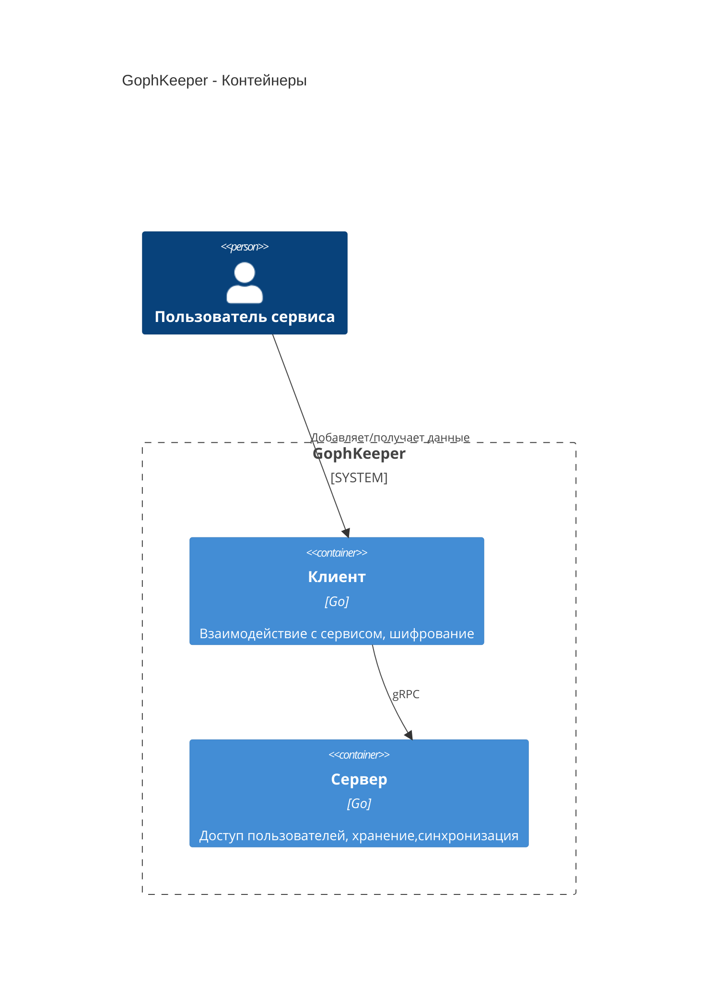

```mermaid
    C4Container
        title GophKeeper - Контейнеры

        Person(Пользователь, "Пользователь сервиса")
        System_Boundary(gk, "GophKeeper") {
            Container(Client, "Клиент", "Go","Взаимодействие с сервисом, шифрование")
            Container(Server, "Сервер", "Go","Доступ пользователей, хранение,синхронизация")
        }

        Rel(Пользователь, Client, "Добавляет/получает данные")
        Rel(Client, Server, "gRPC")
```